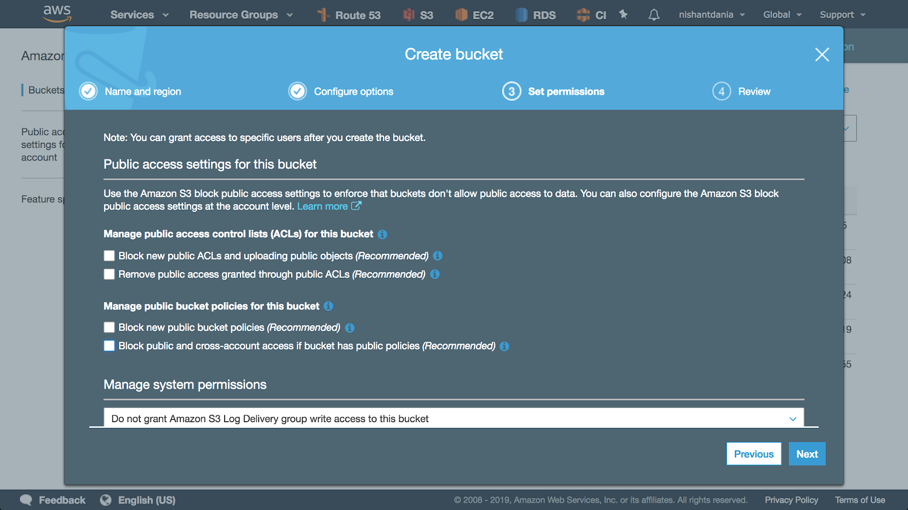
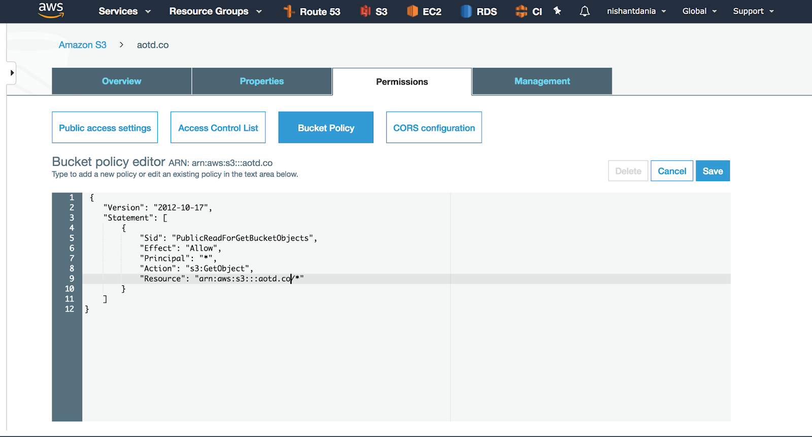
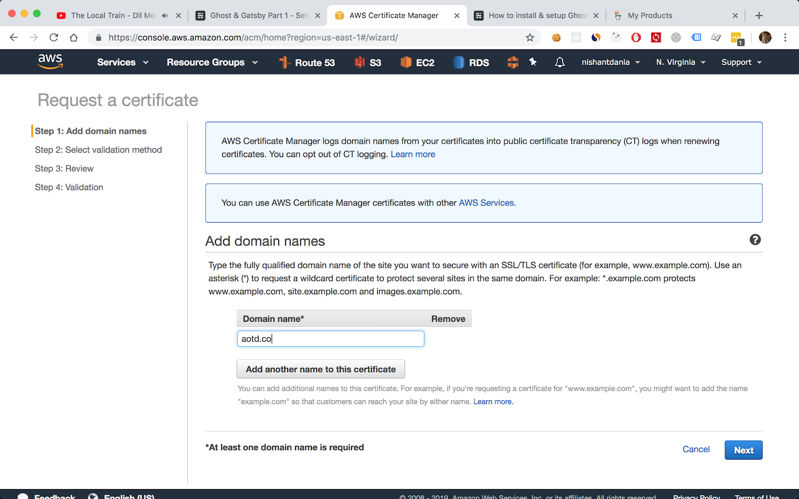

This is the first part of the [series of posts](https://nishantdania.com/blog/guide-to-setup-ghost-gatsby-website) to setup your personal website using GatsbyJS and Ghost deployed on AWS.

Here's what you will end up with after following this post:

- An public S3 (Simple Storage Service) bucket on AWS where all the files generated by Gatsby will be stored
- A CloudFront CDN instance that serves your content and provides an SSL layer for your website
- A couple of DNS records needed to make it all work with your domain
  If you don't have an AWS account, create one now [here](https://aws.amazon.com/).

# Create a public S3 bucket

Open the [S3 console](https://s3.console.aws.amazon.com/s3/home).

Click on `Create Bucket`.

Enter your domain name ( `aotd.co` in my case ) in the bucket name field.

Click `Next`. You don't need to edit anything in the second screen. Click `Next` again.

Grant public access by removing all the restrictions as shown:



Click `Next` and then `Create Bucket`.

Click on the bucket you just created to enter its settings.

Click on the `Properties` tab on the top and then click on `Static website hosting`.

Choose the `Use this bucket to host a website` option, type `index.html` in the Index Document field, note down the endpoint for later and click `Save`:


Click on the `Permissions` tab and then on `Bucket Policy` and type the following policy (Replace the `aotd.co` with your domain name):

```
{
    "Version": "2012-10-17",
    "Statement": [
        {
            "Sid": "PublicReadForGetBucketObjects",
            "Effect": "Allow",
            "Principal": "*",
            "Action": "s3:GetObject",
            "Resource": "arn:aws:s3:::aotd.co/*"
        }
    ]
}
```

Click `Save`:



That's it. You now have an S3 bucket setup to serve public files. Lets add SSL to this domain with CloudFront and Certificate Manager.

# Create an SSL certificate for https

Open the [Certificate Manager](https://console.aws.amazon.com/acm/home).

Click `Request a certificate`.

Choose `Request a public certificate`.

Click `Request a certificate`.

Enter your domain name and click `Add another name to this certificate`.



Enter ASTERISK.YOUR_DOMAIN (e.g \*.aotd.co).

Click `Next`

Choose `DNS Validation` as the validation method and click `Review`.

Click `Confirm and request`.

In the Validation screen, click the domain name to option the dropdown menu and click `Create Record in Route53`. Click `Create` in the modal that pops up. Do this for both the domains (with and without asterisk). Click `Continue`. Wait a while for the certificates to get validated. This will take a few minutes.

You now have the SSL certificates for your domain name.

Take a deep breath and give yourself a pat. You've done a good job till now. We'll now create a CloudFront instance to serve your S3 bucket with this certificate.

# Create a CloudFront instance to serve the S3 bucket via the SSL layer

Open the [CloudFront console](https://console.aws.amazon.com/cloudfront/home).

Click `Create Distribution`.

Click `Get Started` under the `Web` section.

Put the Endpoint of your S3 bucket (the full endpoint, not just the bucket name) in the `Origin Domain Name`.

Find the `Alternate Domain Names (CNAMEs)` field and enter the name of your domain. E.g. `aotd.co`

Choose the `Custom SSL Certificate` option under the `SSL Certificate field` and select the newly created certificate from the dropdown.

Leave everything as is and click `Create Distribution` button at the bottom of the page. This will take about 15 mins to get provisioned and you'll then see the status field saying `Deployed`. Wait for this to happen before proceeding further.

# Create DNS records for your domain

Open the [Route53 console](https://console.aws.amazon.com/route53/home).

Click on `Hosted Zones` in the sidebar.

Click on `Create Hosted Zone`.

Enter your domain name in the `Domain Name` field.

Click `Create`.

You also need to update the `NS` records in your Domain Registrar's website. In my case, I use GoDaddy. Click on the NS record that AWS provided for your hosted zone and update the TTL to 300. Note down the values of the NS records and click `Save record set`. Go to your domain registrar website and update the nameservers for your domain with the AWS ones. This step will be different based on your Registrar. Please google if you can't setup this. Or ask in the [Ghost Gatsby Spectrum channel](https://spectrum.chat/ghost-gatsby).

Click `Create Record Set` to create an A record.

Leave the `Name` field empty. Choose `Alias Yes` option and choose the `Alias Target` as the CloudFront instance you just created. Click `Create`.

That's it. Now your domain points to this CloudFront instance and will serve the files from the S3 bucket.

In the [next part](https://nishantdania.com/blog/ghost-gatsby-part-2-setting-up-a-ghost-blog-on-aws-ec2), you will setup a Ghost Blog on an EC2 instance.

For any questions/doubts/issues, head over to the [Ghost Gatsby Spectrum channel](https://spectrum.chat/ghost-gatsby).
